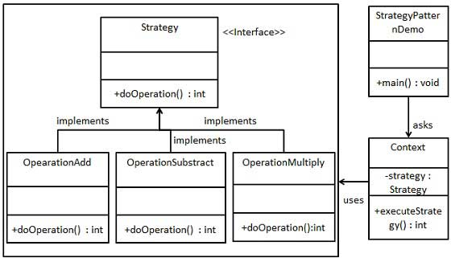

# 如何平滑的更换service层的实现层？

lorne 2023-10-07  

## Service层的简单介绍

Service层是经常被使用到的架构设计，它的作用是将业务逻辑封装起来提供模块化的业务能力。  
我们在日常的项目开发过程中，通常会将service分为接口定义层和实现层。

例如：

接口层的定义

```java

public interface DemoService {

    String hello();
}

```
实现层的定义
```java


@Service
public class DemoServiceImpl implements DemoService {

    @Override
    public String hello() {
        return "Hello World!";
    }
}

```

在项目的使用过程中，通常会直接引用接口对象，然后调用接口中的方法，例如：

```java
@RestController
@RequestMapping("/demo")
@AllArgsConstructor
public class DemoController {

    private final DemoService demoService;

    @GetMapping("/hello")
    public String hello() {
        return demoService.hello();
    }

}

```

## Service层的问题介绍

在上述的例子过程中，我们定义了接口和实现，然后在项目中使用接口调用业务，由于接口与实现的分离感觉像是用了非常好的解耦效果，但是实际作用多大呢，下面我们以不同的场景，分析service层在运用时所存在的局限问题。

下面以场景举例，说明  
### 当需要重写service的逻辑时，该怎么做？  
假如我们需要将hello方法的返回信息，更改为`new Hello World!`，通常大家的处理方式是直接修改DemoServiceImpl的代码。例如：  
```java

@Service
public class DemoServiceImpl implements DemoService {

    @Override
    public String hello() {
        return "new Hello World!";
    }
}

```
如果我们这样去做的话，其实定义service层接口的意义在哪呢？需要调整的时候还是直接修改实现层的代码，那么接口的定义就没有意义了。

总结来说：    
这个场景表达的含义是业务需求做了调整，对于我们实现来说不得不去修改逻辑来应对调整，但是当我们这样去做了以后，将感觉不到service层接口定义的任何价值，只会感觉到service的接口需要多建一个类反而更加麻烦。

### 差异化的业务逻辑，该如何应对？

假如我们开发一个支付系统，作为标准的产品我们支持多种支付方式，例如：微信支付、支付宝支付等，但是系统在上线时需要配置其选择的支付方式，那么我们该如何实现呢？

如下为了简化业务关注与设计，我们直接定义一个PayService的代码。例如：

```java
public interface PayService {

    String pay();
    
}
```

对应不同的实现，需要写不同的实现类，分别是WechatPayServiceImpl和AlipayPayServiceImpl。
```java

@Service
public class WechatPayServiceImpl implements PayService {

    @Override
    public String pay() {
        return "wechat pay";
    }

}

```

```java

@Service
public class AlipayPayServiceImpl implements PayService {

    @Override
    public String pay() {
        return "alipay pay";
    }
}

```

当我们定义了多个Service的实现的时候，我们在使用Service的时候还需要做区分，如果直接注入PayService的话，将会出错，因为Spring无法判断我们需要注入哪个实现，错误示范如下：

```java
@RestController
@RequestMapping("/pay")
@AllArgsConstructor
public class PayController {
    
    private final PayService payService;
    
    @GetMapping("/pay")
    public String pay() {
        return payService.pay();
    }
    
}

```

错误日志如下：
```

***************************
APPLICATION FAILED TO START
***************************

Description:

Parameter 0 of constructor in com.lease.examples.le001.server.controller.PayController required a single bean, but 2 were found:
	- alipayPayServiceImpl: defined in file [C:\Users\linqu\developer\github\le-examples\examples-001\server\target\classes\com\lease\examples\le001\server\service\impl\AlipayPayServiceImpl.class]
	- wechatPayServiceImpl: defined in file [C:\Users\linqu\developer\github\le-examples\examples-001\server\target\classes\com\lease\examples\le001\server\service\impl\WechatPayServiceImpl.class]


Action:

Consider marking one of the beans as @Primary, updating the consumer to accept multiple beans, or using @Qualifier to identify the bean that should be consumed
```

为了解决这个问题，我们需要在使用的时候，指定具体的实现，即对应上线时需要选择的业务实现方式：

```java
@RestController
@RequestMapping("/pay")
@AllArgsConstructor
public class PayController {
    
    @Qualifier("wechatPayServiceImpl")
    private final PayService payService;
    
    @GetMapping("/pay")
    public String pay() {
        return payService.pay();
    }
    
}

```
总结说明：  
当我们需要切换不同Service的实现的时候，还需要做额外的处理，不然在直接注入Service的时候还将会出现错误。通过@Qualifier指定具体的实现，可以解决这个问题，但是这样的处理方式，将会导致Service接口层的定义变得没有意义，因为我们在使用的时候，还需要指定具体的实现，这样的话，我们直接使用实现类不就可以了吗？  


### 当需要兼容适配不同场景时，该怎么做？

假如我们的支付功能，需要同时支持微信和支付宝两种不同方式的支付方式，那么我们的service层应该如何设计？

为了实现这个效果，我们通过引入策略模式来实现。  


调整以后的结果如下：  
接口层的调整：  

```java
public interface PayService {

    String pay();

    boolean support(String payType);
}

```

实现层的定义： 
```java

@Service
public class AlipayPayServiceImpl implements PayService {

    @Override
    public String pay() {
        return "alipay pay";
    }

    @Override
    public boolean support(String payType) {
        return payType.equalsIgnoreCase("alipay");
    }
}

@Service
public class WechatPayServiceImpl implements PayService {

    @Override
    public String pay() {
        return "wechat pay";
    }

    @Override
    public boolean support(String payType) {
        return payType.equalsIgnoreCase("wechat");
    }

}
```

访问层的Factory定义：
```java

import lombok.AllArgsConstructor;
import org.springframework.stereotype.Component;

import java.util.List;

@Component
@AllArgsConstructor
public class PayServiceFactory {

    private final List<PayService> payServiceList;

    public PayService getPayService(String payType) {
        for (PayService payService : payServiceList) {
            if (payService.support(payType)) {
                return payService;
            }
        }
        throw new RuntimeException("not support pay type");
    }
}
```

使用层的定义：
```java

import com.lease.examples.le001.server.service.PayServiceFactory;
import lombok.AllArgsConstructor;
import org.springframework.web.bind.annotation.GetMapping;
import org.springframework.web.bind.annotation.RequestMapping;
import org.springframework.web.bind.annotation.RequestParam;
import org.springframework.web.bind.annotation.RestController;

@RestController
@RequestMapping("/pay")
@AllArgsConstructor
public class PayController {

    private final PayServiceFactory payServiceFactory;

    @GetMapping("/pay")
    public String pay(@RequestParam(value = "payType", defaultValue = "wechat") String payType) {
        return payServiceFactory.getPayService(payType).pay();
    }
    

}

```

总结说明：   
通过引入[策略模式](https://www.runoob.com/design-pattern/strategy-pattern.html)来适配service层是比较方便，可通过添加新的实现拓展新的业务能力，不过实际上这样的处理方式是得力于策略模式的引入而非service层的优势。


不过通过策略模式的引入，可以非常简单的通过添加新的实现来增加新的业务能力，是开闭原则的一种很好的示例. 例如我们增加一个余额支付。
```java

@Service
public class BalancePayServiceImpl implements PayService {

    @Override
    public String pay() {
        return "balance pay";
    }

    @Override
    public boolean support(String payType) {
        return payType.equalsIgnoreCase("balance");
    }

}

```

